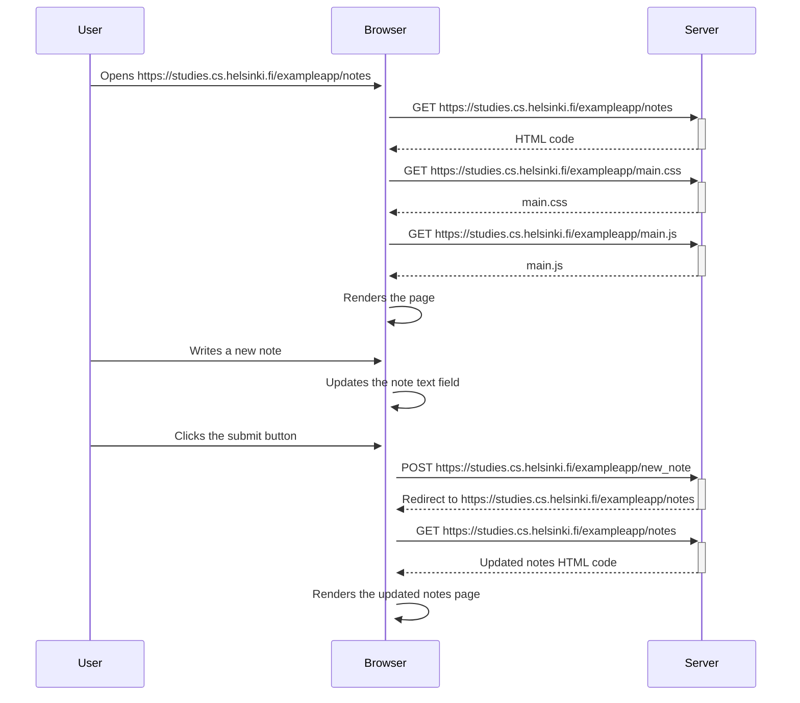
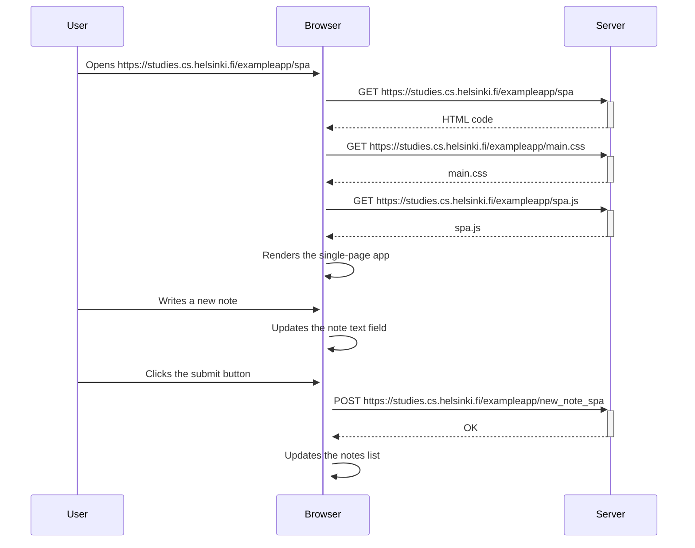
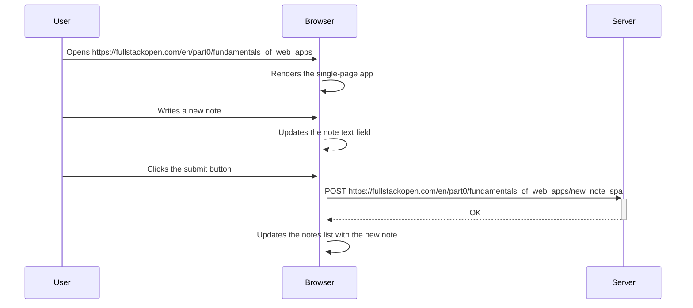

## Excercise 0.4
### Diagram depicting the situation where the user creates a new note on the page https://studies.cs.helsinki.fi/exampleapp/notes by writing something into the text field and clicking the submit button.

## Excercise 0.5
### Diagram depicting the situation where the user goes to the single-page app version of the notes app at https://studies.cs.helsinki.fi/exampleapp/spa

## Excercise 0.6
### Diagram depicting the situation where the user creates a new note using the single-page version of the app.

